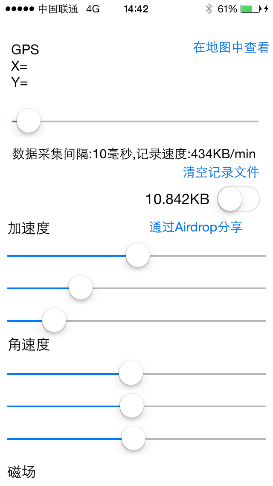
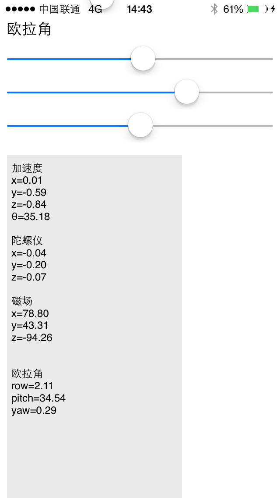

# Acceleration-iOS

------

    使用个app，你可以直观地看到加速度、角速度、磁场强度、GPS 坐标以及欧拉角的原始数据。你还可以记录数据（CSV 格式），通过 AirDrop 发送到电脑上，并进一步分析它们。
    使用swift语言编写，可以运行在 iPhone 和 iPad 上。

数据片段:

------

    1426748394856,acc,0.136993,-0.659515,-0.726654
    1426748394875,gyro,-0.100384,-0.114738,-0.0436093
    1426748394877,mag,82.6144,40.8925,-91.2895
    1426748394879,ori,9.99214,40.2739,17.8697
    1426748394894,acc,0.112091,-0.632294,-0.726913
    1426748394897,gyro,-0.112,-0.105289,-0.0542204
    1426748394899,mag,82.2675,39.1638,-90.6285
    1426748394901,ori,9.8517,40.2171,17.8755
    1426748394918,acc,0.121384,-0.662216,-0.736862
    1426748394920,gyro,-0.18068,-0.0707096,-0.0743965
    1426748394921,mag,84.5223,39.3367,-89.8023
    1426748394923,ori,9.79895,40.1112,17.8322
    1426748394972,gps,39.7160627117302,116.165109140419
